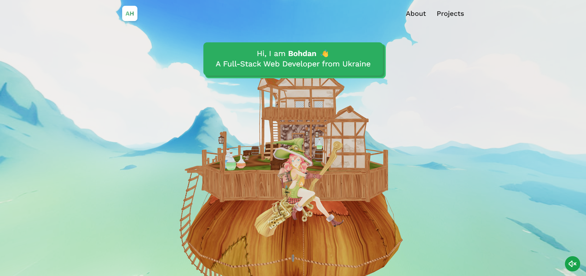
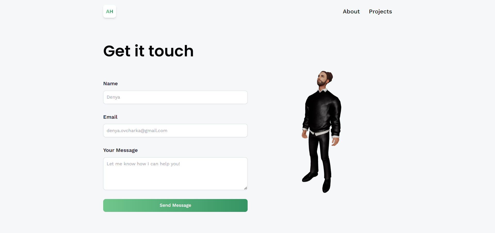

# Three.js Portfolio

This portfolio website adopts a steampunk theme, complemented by interactive features such as a dynamic 3D object on the homepage. It provides an overview of my technology stack, showcases various projects, and offers a contact form with an animated representation of my avatar.

## Technologies Used

- HTML5
- CSS3
- JavaScript
- React.js
- Tailwind CSS
- Three.js
- EmailJS

## Features

- Dynamic 3D object on the homepage
- Animated representation of my avatar on the contact form
- Music player functionality for listening to tracks
- Contact form with EmailJS integration for sending messages directly to my email

## License

This project is licensed under the [License Name]. See the [LICENSE](LICENSE) file for details.

## Acknowledgements

- [Build and Deploy an Amazing 3D](https://www.youtube.com/watch?v=FkowOdMjvYo&t=694s&ab_channel=JavaScriptMastery) for inspiration and guidance.
- [ReadyPlayerMe](https://readyplayer.me) for providing the avatar creation service.
  
## Project Link

Project Link: [My Portfolio](https://brrudenko-portfolio.netlify.app/)

## Screenshots

### Homepage of the website

### My Metahuman

## Contact

For any questions or suggestions regarding this project, feel free to contact me via [LinkedIn](https://www.linkedin.com/in/b-r-rudenko/).
